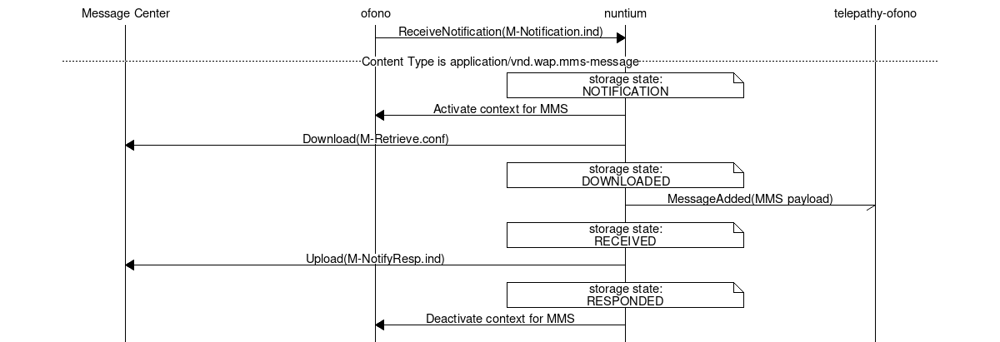

# Architecture

## Overview

`nuntium` lies in between `ofono` over the system bus and `telepathy-ofono`
over the session bus.

`nuntium` registers an agent against `ofono`'s `push notification` plugin and
sets up to receive DBus method calls from `ofono` when push messages arrive.
And it creates an instance on the session to handle method calls from
`telepathy-ofono` to send messages and signal message and service events.

### Receiving an MMS

This is a simplified scenario for an incoming message with deferral's set to
false:

#### Message path from nuntium to history service through code in Ubuntu Touch
- telepathy-ofono
  - [MMSDService::onMessageAdded](https://github.com/ubports/telepathy-ofono/blob/xenial/mmsdservice.cpp#L116)
  - [oFonoConnection::onMMSAdded](https://github.com/ubports/telepathy-ofono/blob/xenial/connection.cpp#L518)
  - [oFonoConnection::addMMSToService](https://github.com/ubports/telepathy-ofono/blob/xenial/connection.cpp#L423)
  - [oFonoTextChannel::mmsReceived](https://github.com/ubports/telepathy-ofono/blob/xenial/ofonotextchannel.cpp#L473)
- telepathy-qt
  - [BaseChannelTextType::addReceivedMessage](https://github.com/TelepathyIM/telepathy-qt/blob/telepathy-qt-0.9.7/TelepathyQt/base-channel.cpp#L473)
- history-service
  - [HistoryDaemon::onMessageReceived](https://github.com/ubports/history-service/blob/xenial/daemon/historydaemon.cpp#L1023)

### Sending an MMS

This is a simplified scenario for sending a message with message delivery set
to false:

